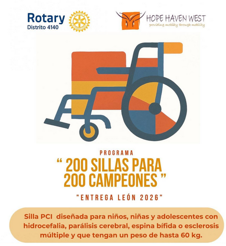
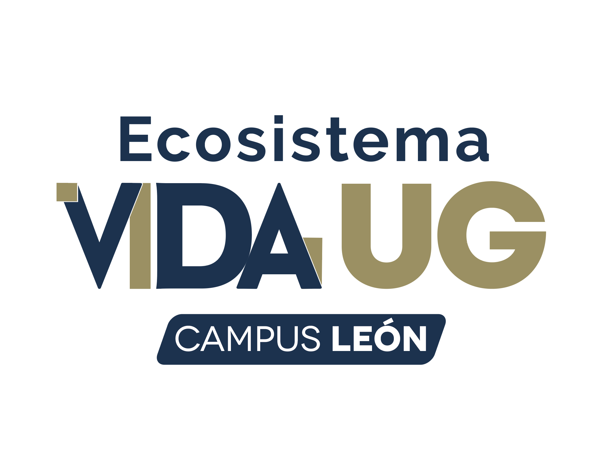

<div align="center">


&nbsp;&nbsp;&nbsp;&nbsp;

&nbsp;&nbsp;&nbsp;&nbsp;


<br/><br/>

# Sistema Integral de Gestión Social y Técnica
## Ecosistema VIDA UG

> Digitalización del programa de donación de sillas de ruedas — eliminando el papel en el trabajo de campo.

<br/>

[](https://github.com/AndreRaz/Sillas-Rotary)
[](https://python.org)
[](https://fastapi.tiangolo.com)
[](https://tailwindcss.com)
[](https://sqlite.org)

</div>

---

## Índice

- [¿Qué es este sistema?](#qué-es-este-sistema)
- [Capturas de pantalla](#capturas-de-pantalla)
- [Estructura del proyecto](#estructura-del-proyecto)
- [Requisitos previos](#requisitos-previos)
- [Instalación y puesta en marcha](#instalación-y-puesta-en-marcha)
- [Cómo funciona la aplicación](#cómo-funciona-la-aplicación)
- [Módulos del sistema](#módulos-del-sistema)
- [API — Endpoints](#api--endpoints)
- [Base de datos](#base-de-datos)
- [Ver los datos registrados](#ver-los-datos-registrados)
- [Seguridad](#seguridad)
- [Roadmap a producción](#roadmap-a-producción)
- [Desarrollado por NEUXORA](#desarrollado-por-neuxora)

---

## ¿Qué es este sistema?

El **Sistema Integral de Gestión Social y Técnica** es una aplicación web **mobile-first** diseñada para capturistas de campo del programa **Ecosistema VIDA UG** (Universidad de Guanajuato + Rotary 200).

### El problema que resuelve

Antes del sistema, el proceso era completamente en papel:
los capturistas llenaban formularios físicos en campo, los datos se transcribían manualmente, se perdía información, y no existía trazabilidad de los expedientes.

### La solución

Una app web que funciona en cualquier teléfono o tablet, sin instalación, sin contraseña compleja. El capturista registra su nombre y puede capturar expediente tras expediente en el mismo turno.

### ¿Qué registra?

| Módulo | Datos capturados |
|---|---|
| **Acceso** | Nombre del capturista (trazabilidad de quién registró cada caso) |
| **Estudio socioeconómico** | Datos del beneficiario, domicilio, tutores, ingresos familiares, historial |
| **Solicitud técnica** | Entorno de uso, capacidad postural, 5 medidas corporales en pulgadas, fotografía clínica, prioridad |

---

## Estructura del proyecto

```
Sillas-Rotary/
│
├── front/                          # Frontend — HTML5 + Tailwind CSS + Vanilla JS
│   ├── login.html                  # Módulo 1 — Acceso al sistema
│   ├── socioeconomico.html         # Módulo 2 — Estudio socioeconómico
│   ├── tecnica.html                # Módulo 3 — Solicitud técnica + medidas + foto
│   └── assets/                     # Recursos estáticos locales
│       ├── Logo_ug.png             # Logo Universidad de Guanajuato
│       ├── Logo_rotary_200.png     # Logo Rotary 200
│       ├── logo_vida_ug.png        # Logo Ecosistema VIDA UG
│       ├── guia_clinica.png        # Diagrama de referencia — toma de medidas
│       └── iconografia_silla.png   # Ícono de silla de ruedas
│
├── backend/                        # API REST — FastAPI + SQLite
│   ├── main.py                     # Punto de entrada: CORS, rutas, static files
│   ├── database.py                 # Context manager de conexión SQLite
│   ├── init_db.py                  # DDL: crea tablas e índices al iniciar
│   ├── requirements.txt            # Dependencias Python
│   ├── start.sh                    # Script de arranque (crea venv + levanta servidor)
│   ├── .env.example                # Plantilla de variables de entorno
│   ├── uploads/                    # Imágenes subidas (UUID, excluido del repo)
│   └── routers/
│       ├── auth.py                 # POST /api/login
│       ├── socioeconomico.py       # Estudio socioeconómico (crear, actualizar, obtener)
│       └── tecnica.py              # Solicitud técnica + upload de foto
│
├── PRD.md                          # Product Requirements Document original
├── .gitignore
└── README.md
```

---

## Requisitos previos

| Herramienta | Versión mínima | Notas |
|---|---|---|
| **Python** | 3.12 | `pydantic-core` no soporta Python 3.14 todavía |
| **Navegador** | Cualquier moderno | Chrome, Firefox, Safari — desktop y mobile |
| **Node.js** | — | **No requerido** — Tailwind CSS se carga vía CDN |
| **Git** | Cualquier | Para clonar el repositorio |

---

## Instalación y puesta en marcha

### 1. Clonar el repositorio

```bash
git clone https://github.com/AndreRaz/Sillas-Rotary.git
cd Sillas-Rotary
```

### 2. Levantar el backend

```bash
cd backend
bash start.sh
```

El script hace todo automáticamente:

```
→ Crea el entorno virtual con Python 3.12
→ Instala las dependencias de requirements.txt
→ Inicializa la base de datos SQLite (tablas + índices)
→ Levanta el servidor en http://localhost:8000
```

Para verificar que está corriendo:

```bash
curl http://localhost:8000/
# {"status":"ok","sistema":"Sillas Rotary API"}
```

La documentación interactiva de la API estará disponible en:
**`http://localhost:8000/docs`**

### 3. Abrir el frontend

Abrir `front/login.html` directamente en el navegador (doble click o drag & drop).

> **Nota:** Los HTMLs usan rutas relativas entre sí (`login.html` → `socioeconomico.html` → `tecnica.html`) y hacia `assets/`, por lo que funcionan perfectamente abriendo los archivos con `file://` sin necesidad de un servidor adicional.

### Dependencias Python

```
fastapi==0.115.0
uvicorn[standard]==0.30.6
python-multipart==0.0.9
aiofiles==23.2.1
pydantic==2.7.4
sqlite-web          # Para inspección visual de la base de datos
```

---

## Cómo funciona la aplicación

```
┌──────────────────────────────────────────────────────┐
│                    login.html                        │
│                                                      │
│  El capturista ingresa su nombre                     │
│  POST /api/login → sesión en localStorage            │
│  Si ya existe sesión → salta directo al paso 2       │
└─────────────────────┬────────────────────────────────┘
                      │  ✓ sesión activa
                      ▼
┌──────────────────────────────────────────────────────┐
│               socioeconomico.html                    │
│                                                      │
│  Datos del beneficiario + 1 o 2 tutores              │
│  POST /api/estudios → beneficiario_id en localStorage│
│  Permite guardar borrador o estudio completo         │
│                                                      │
│  [Cambiar capturista] → limpia sesión → login        │
└─────────────────────┬────────────────────────────────┘
                      │  ✓ estudio guardado
                      ▼
┌──────────────────────────────────────────────────────┐
│                  tecnica.html                        │
│                                                      │
│  Entorno, capacidad postural, 5 medidas, foto        │
│  POST /api/upload-foto (opcional)                    │
│  POST /api/solicitudes                               │
│                                                      │
│  Al guardar completo → limpia beneficiario_id        │
└─────────────────────┬────────────────────────────────┘
                      │  ✓ solicitud guardada
                      ▼
             socioeconomico.html
          (mismo capturista, nuevo beneficiario)
```

---

## Módulos del sistema

### Módulo 1 — Acceso (`login.html`)

- El capturista ingresa solo su nombre (sin contraseña)
- El backend registra o recupera al capturista en la tabla `capturistas`
- La sesión se guarda en `localStorage` con `capturista_id` y nombre
- Si hay sesión activa, el nombre se pre-llena automáticamente

### Módulo 2 — Estudio Socioeconómico (`socioeconomico.html`)

Captura en un solo formulario:

**Datos del beneficiario:**
nombre, fecha de nacimiento, diagnóstico médico, domicilio completo (calle, colonia, ciudad), teléfonos

**Datos de tutores (1 obligatorio, 2 opcional):**
nombre, edad, nivel de estudios, estado civil, número de hijos, tipo de vivienda, fuente de empleo, antigüedad, ingreso mensual, afiliación IMSS / INFONAVIT

**Cierre del estudio:**
otras fuentes de ingreso, historial previo de silla de ruedas, elaboró el estudio, fecha, sede

Soporta **guardar borrador** (status `borrador`) para continuar después, y **guardar estudio** (status `completo`) para avanzar al módulo técnico.

### Módulo 3 — Solicitud Técnica (`tecnica.html`)

- **Entorno de uso:** Urbano / Rural / Mixto
- **Capacidad postural:** control de tronco, control de cabeza, observaciones clínicas (escoliosis, etc.)
- **Medidas corporales** (en pulgadas): altura total, peso, cabeza–asiento, hombro–asiento, profundidad asiento, rodilla–talón, ancho de cadera
- **Fotografía clínica:** upload de JPG/PNG hasta 10 MB (guardada con nombre UUID)
- **Gestión:** entidad solicitante, prioridad (Alta / Media), justificación

---

## API — Endpoints

| Método | Ruta | Descripción |
|---|---|---|
| `GET` | `/` | Health check |
| `POST` | `/api/login` | Registrar o recuperar capturista por nombre |
| `POST` | `/api/estudios` | Crear estudio socioeconómico completo |
| `PATCH` | `/api/estudios/{id}` | Actualizar campos del estudio |
| `GET` | `/api/estudios/{id}` | Obtener estudio con beneficiario y tutores |
| `POST` | `/api/upload-foto` | Subir imagen (JPG/PNG ≤ 10 MB) → retorna `foto_url` |
| `POST` | `/api/solicitudes` | Crear solicitud técnica |
| `PATCH` | `/api/solicitudes/{id}` | Actualizar solicitud técnica |
| `GET` | `/api/solicitudes/{id}` | Obtener solicitud técnica por ID |

### Ejemplo — Crear estudio socioeconómico

```bash
curl -X POST http://localhost:8000/api/estudios \
  -H "Content-Type: application/json" \
  -d '{
    "capturista_id": 1,
    "beneficiario": {
      "nombre": "Ana García López",
      "fecha_nacimiento": "1990-05-15",
      "diagnostico": "Parálisis cerebral",
      "calle": "Av. López Mateos 123",
      "colonia": "Centro",
      "ciudad": "León",
      "telefonos": "4621234567"
    },
    "tutores": [{
      "numero_tutor": 1,
      "nombre": "Carlos García",
      "edad": 45,
      "ingreso_mensual": 8000,
      "tiene_imss": true,
      "tiene_infonavit": false
    }],
    "estudio": {
      "tuvo_silla_previa": false,
      "elaboro_estudio": "Capturista Ejemplo",
      "fecha_estudio": "2026-03-26",
      "sede": "León",
      "status": "completo"
    }
  }'
```

---

## Base de datos

SQLite en desarrollo (`backend/sillas.db`, excluido del repo). Para producción se recomienda migrar a **Supabase** (ver `.env.example`).

```
capturistas
├── id  ·  nombre  ·  fecha_registro

beneficiarios
├── id  ·  nombre  ·  fecha_nacimiento  ·  diagnostico
└── calle  ·  colonia  ·  ciudad  ·  telefonos

tutores  ──→  beneficiarios
├── id  ·  beneficiario_id  ·  numero_tutor (1 o 2)
└── nombre  ·  edad  ·  nivel_estudios  ·  estado_civil
    vivienda  ·  fuente_empleo  ·  ingreso_mensual
    tiene_imss  ·  tiene_infonavit

estudios_socioeconomicos  ──→  beneficiarios + capturistas
├── id  ·  beneficiario_id  ·  capturista_id
└── sede  ·  fecha_estudio  ·  otras_fuentes_ingreso
    tuvo_silla_previa  ·  status (borrador | completo)

solicitudes_tecnicas  ──→  beneficiarios + capturistas
├── id  ·  beneficiario_id  ·  capturista_id
└── entorno  ·  control_tronco  ·  control_cabeza
    altura_total_in  ·  peso_kg  ·  5 medidas en pulgadas
    foto_url  ·  prioridad (Alta | Media)  ·  status
```

---

## Ver los datos registrados

`sqlite-web` provee una UI web para navegar tablas, filtrar, ejecutar SQL y exportar:

```bash
cd backend
source venv/bin/activate
sqlite_web sillas.db --port 8002 --no-browser
```

Abrir **`http://localhost:8002/`** en el navegador.

---

## Seguridad

| Aspecto | Implementación |
|---|---|
| Upload de imágenes | Validación doble: MIME type + extensión (solo `.jpg` / `.png`) |
| Tamaño de archivos | Límite de 10 MB por imagen rechazado en backend |
| Nombres de archivos | UUID aleatorio — no se expone el nombre original |
| Campos numéricos | Validación Pydantic + constraints en SQLite (edad, medidas, ingresos) |
| Integridad referencial | Foreign keys activas con `PRAGMA foreign_keys = ON` |
| CORS | Configurado en `main.py` — restringir origins en producción |

---

## Roadmap a producción

- [ ] Migrar SQLite → Supabase (configurar `.env` con credenciales)
- [ ] Migrar `uploads/` → Supabase Storage bucket
- [ ] Restringir `allow_origins` en `main.py` al dominio del frontend
- [ ] Agregar JWT con expiración para reemplazar `localStorage` simple
- [ ] Servir el frontend desde HTTPS
- [ ] Verificar Python 3.12 en el entorno de despliegue

---

## Desarrollado por NEUXORA

<div align="center">

**[NEUXORA — Agencia de Tecnología e IA](https://andreraz.github.io/)**

*Hacemos posible lo imposible, porque lo difícil lo puede hacer cualquiera.*

León, Guanajuato, México &nbsp;·&nbsp; Lun–Sab 9:00–20:00

| | |
|---|---|
| 📞 Teléfono / WhatsApp | [+52 462 272 2089](https://wa.me/524622722089) |
| 📧 Email | [cmed.beta@gmail.com](mailto:cmed.beta@gmail.com) |
| 🌐 Web | [andreraz.github.io](https://andreraz.github.io/) |

<br/>

| Departamento | Especialidad |
|---|---|
| **C-MED** | Apps médicas, expedientes clínicos, dispositivos personalizados con trazabilidad |
| **EDU-IA** | Plataformas educativas adaptativas con IA y analítica en tiempo real |
| **Investigación** | Modelos ML/DL, visión por computadora, simulaciones científicas |

<br/>

*Proyecto desarrollado para el programa **Ecosistema VIDA UG** —*
*Universidad de Guanajuato en colaboración con Rotary 200.*

</div>
